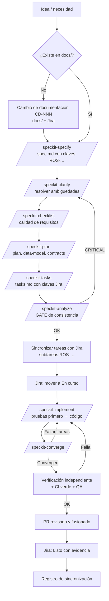
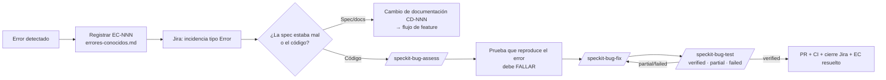

# Flujo de trabajo

Este documento describe **el camino completo de cualquier trabajo** en Rosetta, desde que aparece una idea hasta que está en producción y verificado.

## 1. Las fases del proyecto

| Fase | Nombre | Qué se hace | Estado |
|---|---|---|---|
| 0 | **Documentación** | Plasmar todo lo conocido en `docs/` (esta carpeta) | ✅ En curso (esta entrega) |
| 0.5 | **Preparación** | Repositorio git, Spec Kit, constitución, esqueleto Django/Next.js, CI, bloque "Fuente de verdad" en Jira | ⏭️ Siguiente |
| 1 | **MVP** | Sprints 1–5 (ver [roadmap](../01-producto/05-roadmap-y-sprints.md)) | Pendiente |
| 2 | Fase 2 | Hallazgos, generador, exportación, MFA… | Pendiente |
| 3 | Fase 3 | Grafo/ERD, colaboración, monetización… | Pendiente |
| 4 | Fase 4 · MCP | Servidor MCP, API pública | Pendiente |

## 2. El ciclo de una feature (de punta a punta)



### Paso a paso

| # | Paso | Responsable | Artefacto de salida | Estado Jira |
|---|---|---|---|---|
| 1 | Confirmar que la necesidad está en `docs/`. Si no, crear un **cambio de documentación** (`CD-NNN`) | Quien propone | PR de docs | — |
| 2 | Crear la feature con `/speckit-specify`, listando las historias `ROS-…` que cubre | Líder técnico o agente | `specs/NNN-*/spec.md`, rama `NNN-*` | Historias → *Por hacer* |
| 3 | `/speckit-clarify` hasta que no queden marcadores de aclaración | Dueño de producto + agente | spec actualizada | — |
| 4 | `/speckit-checklist` de requisitos | Revisor | `checklists/requirements.md` | — |
| 5 | `/speckit-plan` usando el stack de [03-arquitectura](../03-arquitectura/) | Líder técnico o agente | `plan.md`, `data-model.md`, `contracts/`, `quickstart.md`, `research.md` | — |
| 6 | `/speckit-tasks` | Agente | `tasks.md` | — |
| 7 | `/speckit-analyze` — **gate** | Agente + revisor | Informe sin CRITICAL | — |
| 8 | Sincronizar `tasks.md` con Jira: cada `T###` se asocia a una subtarea `ROS-…` existente o se crea una nueva | Quien planifica | `tasks.md` con claves; Jira actualizado | Subtareas → *Por hacer* |
| 9 | Tomar la tarea en Jira | Desarrollador / agente | — | Subtarea → *En curso* |
| 10 | `/speckit-implement`: **primero la prueba que falla**, luego el código | Desarrollador / agente | Código + pruebas en la rama | — |
| 11 | `/speckit-converge`; repetir 10–11 hasta "Converged" | Agente | `tasks.md` sin trabajo pendiente | — |
| 12 | Verificación independiente (no la hace quien implementó) + CI verde + QA manual si aplica | Verificador | Evidencia en el PR | Subtarea → *En revisión* |
| 13 | PR revisado y fusionado a `main` | Revisor | Commit en `main` | — |
| 14 | Cerrar subtarea e historia con la evidencia enlazada | Quien verificó | Comentario en Jira con evidencia | → *Listo* |
| 15 | Anotar en el [registro de sincronización](../07-registro/03-registro-de-sincronizacion.md) | Quien cerró | Línea en el registro | — |

## 3. El ciclo de un error



**Regla:** si al investigar el error resulta que **la especificación estaba equivocada o incompleta**, no se "arregla el código": se corrige primero `docs/` y la spec, y el arreglo baja desde ahí. Eso evita el spec drift.

## 4. El ciclo de un cambio de requisito

Ver el procedimiento completo en [04-sincronizacion.md](04-sincronizacion.md). En resumen: **docs → spec → Jira → código → verificación → registro**, siempre en ese orden.

## 5. Ceremonias

| Ceremonia | Cuándo | Qué se revisa | Salida |
|---|---|---|---|
| **Planificación de sprint** | Inicio de sprint | Historias del sprint listas según [DoR](../06-calidad/02-definicion-de-listo-y-terminado.md) | Sprint en Jira; features de Spec Kit identificadas |
| **Revisión de spec** | Antes de `/speckit-plan` | Checklist de requisitos, no-objetivos, ambigüedades | Spec aprobada |
| **Revisión de PR** | Cada PR | Trazabilidad, pruebas, DoD, sin drift | PR aprobado |
| **Auditoría de sincronización** | Fin de cada sprint | docs ↔ specs ↔ Jira ↔ código (ver [04-sincronizacion.md §8](04-sincronizacion.md)) | Entrada en el registro; errores registrados |
| **Retrospectiva** | Fin de sprint | Qué falló del proceso | Cambios a esta metodología vía CD |

## 6. Estados en Jira

El proyecto `ROS` es *team-managed* y hoy tiene el estado por defecto **"Por hacer"**. Flujo objetivo:

```text
Por hacer → En curso → En revisión → Listo
                 ↑            │
                 └── (falla) ─┘
```

| Estado | Significa | Condición para entrar |
|---|---|---|
| Por hacer | Definida y lista para tomar | Cumple la Definición de Listo |
| En curso | Alguien (persona o agente) trabaja en ella | Asignada; rama creada |
| En revisión | Implementada; esperando verificación independiente | PR abierto; `/speckit-converge` = Converged; CI verde |
| Listo | Verificada y fusionada | Cumple la Definición de Terminado **con evidencia enlazada** |

> `[PENDIENTE]` El flujo actual de `ROS` tiene *Por hacer*, *En curso* y *Listo* (verificado 2026-09-29). Falta crear *En revisión* en el flujo del proyecto `ROS` durante la fase de preparación (ver [DP-012](../07-registro/02-decisiones-pendientes.md)).
