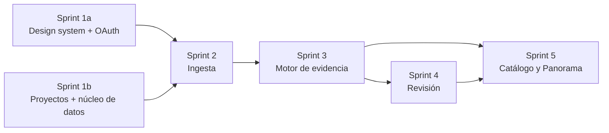

# Roadmap y sprints

## 1. Fases del producto

| Fase | Contenido | Épicas principales | Historias |
|---|---|---|---|
| **0 · Documentación** | Esta carpeta `docs/` | — | — |
| **0.5 · Preparación** | Repositorio, Spec Kit, constitución, esqueletos, CI, sincronización Jira | — | Tareas técnicas (ver §4) |
| **1 · MVP** | Las 5 pantallas núcleo + motor + ingesta básica + auth OAuth + persistencia | E01–E05, E10–E14 | 38 |
| **2** | Hallazgos, generador, exportación, más fuentes, modo sin LLM, umbral configurable, FK inferidas, MFA, historial | E01–E07, E10, E12–E14 | 32 |
| **3** | Grafo/ERD, colaboración y roles, SSO, conectores directos, administración y monetización B2B | E01, E06–E08, E10, E11, E13–E15 | 29 |
| **4 · MCP** | Servidor MCP, API pública, webhooks, métricas de ingresos, fiscalidad | E09, E15 | 5 |

Total: **104 historias**.

## 2. Plan de sprints del MVP

Los sprints siguen el orden de dependencias: sin ingesta no hay evidencia, sin motor no hay revisión.

| Sprint | Foco | Features Spec Kit | Tareas | Horas |
|---|---|---|---|---|
| **1 · Fundaciones** | Design system, OAuth y sesiones, proyectos, modelo de datos del núcleo, seguridad | 001, 002, 003 | 23 | 174 h |
| **2 · Ingesta** | Parser DDL, perfilado de muestras, convenciones, evidencia normalizada | 004 | 12 | 93 h |
| **3 · Motor de evidencia** | Puntuación (nombre 0,40), niveles, abstención, conflictos, propagación, citas, cola | 005, 006 | 14 | 104 h |
| **4 · Revisión** | Ficha, perfil, acciones, previsualización, avisos, atajos, estados | 007 | 11 | 82 h |
| **5 · Catálogo y Panorama** | Catálogo, chips, rastro, estado compartido, dashboard y widgets | 008, 009 | 11 | 79 h |
| **Total** | | | **71** | **532 h** |

Detalle de cada tarea: [03-tareas-mvp.md](../02-requisitos/03-tareas-mvp.md).

### Avisos sobre el plan

1. **El Sprint 1 está sobrecargado** (174 h, más del doble que el 4 o el 5). Propuesta: dividirlo en **1a · Design system + OAuth** (ROS-74, 75, 89–93: 99 h) y **1b · Proyectos + persistencia + seguridad** (ROS-78, 81, 84: 75 h). Ver [EC-009](../07-registro/01-errores-conocidos.md) y [DP-011](../07-registro/02-decisiones-pendientes.md).
2. **Las horas son esfuerzo, no calendario.** A ~60 h útiles por semana (2 personas a medio tiempo) el MVP sale en ~9 semanas; con 3 personas, ~6.
3. **Mayor incertidumbre:** tareas del motor (Sprint 3) y el modelo de datos del núcleo (ROS-175).
4. El widget de hallazgos del Panorama (ROS-40/ROS-150) depende de un concepto de "hallazgo" que se formaliza en la Fase 2 (E06). En el MVP se calcula a partir de conflictos abiertos y columnas desconocidas.

## 3. Dependencias entre sprints

## 4. Fase 0.5 — Preparación (lo que sigue después de esta documentación)

Tareas técnicas previstas (se crearán en Jira como tipo *Tarea* mediante el CD-001):

| # | Tarea | Resultado |
|---|---|---|
| 1 | Inicializar repositorio git y remoto (GitHub) | Repo con `docs/` como primer commit |
| 2 | Instalar Spec Kit e inicializar (`specify init . --integration claude`) | `.specify/`, plantillas |
| 3 | Ratificar la constitución (`/speckit-constitution` desde [08-constitucion.md](../00-metodologia/08-constitucion.md)) | `.specify/memory/constitution.md` v1.0.0 |
| 4 | Crear `CLAUDE.md` / `AGENTS.md` mínimos que apunten a `docs/` | Agentes orientados |
| 5 | Esqueleto `backend/` (Django + DRF + Celery) y `frontend/` (Next.js) | Proyectos que arrancan vacíos |
| 6 | `docker-compose` de desarrollo (PostgreSQL, Redis) | Entorno local reproducible |
| 7 | CI (lint, tipos, pruebas, cobertura, trazabilidad) | Pipeline en verde con el esqueleto |
| 8 | Estado de Jira *En revisión* (ya existen *Por hacer*, *En curso*, *Listo*) | Flujo del proyecto ROS |
| 9 | Bloque "Fuente de verdad" en las 190 incidencias de Jira | EC-004 resuelto |
| 10 | Resolver o aceptar las decisiones pendientes bloqueantes del MVP | DP-001, DP-002, DP-003, DP-011 |
| 11 | Obtener los archivos del sistema de diseño (styles.css de Nocturne) | EC-001 resuelto |
| 12 | Script de auditoría de sincronización | `tools/sync_audit.py` |
