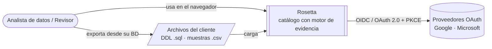
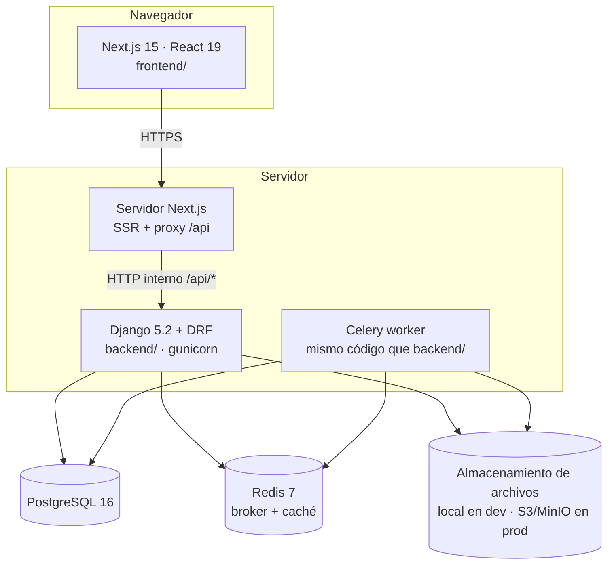
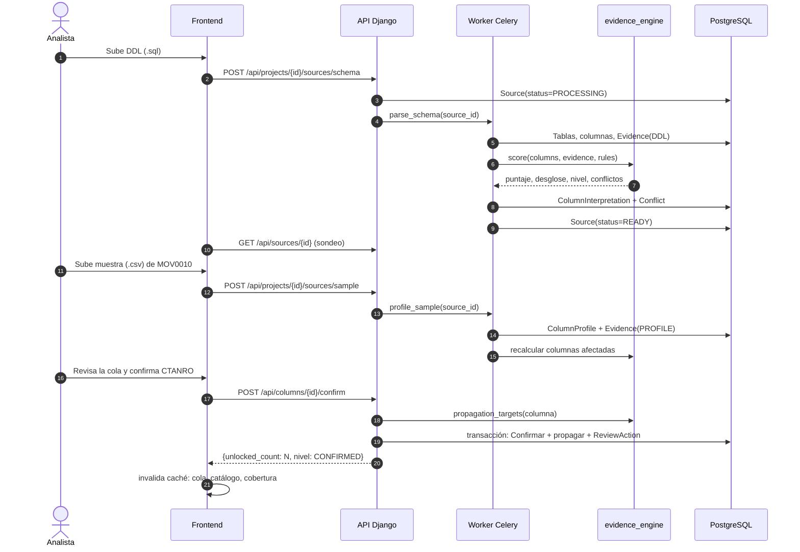

# Arquitectura — visión general

> Describe **cómo** se construye Rosetta. Las decisiones con alternativas y consecuencias están en [adr/](adr/README.md). Las specs (`specs/NNN-*/plan.md`) **no pueden contradecir** este documento; si una feature necesita otra cosa, primero se cambia aquí (CD) y, si es una decisión estructural, se escribe un ADR.

## 1. Principios de arquitectura

| # | Principio | Consecuencia práctica |
|---|---|---|
| A1 | **Monolito modular** en el backend | Un solo proyecto Django con apps por dominio; nada de microservicios en el MVP ([ADR-0002](adr/ADR-0002-monorepo-y-monolito-modular.md)) |
| A2 | **El motor de evidencia es Python puro** | `evidence_engine` no importa Django: recibe estructuras de datos y devuelve puntajes/niveles. Se prueba sin base de datos y es determinista ([ADR-0005](adr/ADR-0005-motor-determinista-sin-llm.md)) |
| A3 | **El backend es la única fuente de estado** | El frontend no calcula niveles, puntajes ni conteos; solo los muestra. El "estado compartido" (RN-18) es la caché del cliente invalidada tras cada mutación |
| A4 | **API REST documentada con OpenAPI** | El contrato ([05-api.md](05-api.md)) se genera desde el código con drf-spectacular y se compara en CI |
| A5 | **Trabajo pesado fuera de la petición** | Parseo de DDL grande, perfilado de muestras y recálculo masivo van a Celery ([ADR-0003](adr/ADR-0003-trabajo-asincrono-celery-redis.md)) |
| A6 | **Solo lectura sobre el origen** | Rosetta nunca se conecta en escritura a la base del cliente; en el MVP ni siquiera se conecta: trabaja con archivos (NO-01, NO-02) |
| A7 | **Preparado para multi-tenant, sin implementarlo** | Las entidades raíz tienen `organization_id` nullable desde el MVP para no migrar destructivamente en Fase 3 ([ADR-0004](adr/ADR-0004-multitenancy-preparado.md)) |

## 2. Diagrama de contexto (C4 nivel 1)

Fuera del MVP: conexión directa a motores (ROS-24, Fase 3), SSO empresarial (ROS-102), pasarela de pago (ROS-112), servidor MCP (ROS-71).

## 3. Diagrama de contenedores (C4 nivel 2)

| Contenedor | Tecnología | Responsabilidad |
|---|---|---|
| **frontend** | Next.js 15 (App Router), React 19, TypeScript | Pantallas, navegación, atajos de teclado, caché de datos del cliente. Sirve la app y **reenvía** `/api/*` y `/auth/*` al backend (mismo origen → cookies `SameSite=Lax` sin CORS) |
| **backend (api)** | Django 5.2, DRF, drf-spectacular, django-allauth | API REST, autenticación OAuth, reglas de negocio, persistencia, orquestación del motor |
| **worker** | Celery 5 | Parseo de DDL, perfilado de muestras, recálculo de puntajes a gran escala |
| **PostgreSQL** | 16 | Todos los datos de Rosetta (usuarios, proyectos, catálogo, evidencia, acciones) |
| **Redis** | 7 | Broker de Celery, resultados de tareas, caché de métricas (cobertura) |
| **Almacenamiento** | Sistema de archivos (dev) / S3 compatible (prod) | Archivos subidos (DDL, CSV) mientras se procesan y según la política de retención ([DP-013](../07-registro/02-decisiones-pendientes.md)) |

## 4. Flujo de datos principal

## 5. Módulos del sistema y su dueño funcional

| Módulo (app Django) | Épicas | Historias MVP | Feature Spec Kit |
|---|---|---|---|
| `accounts` | E14 | ROS-89…93 | 002 |
| `projects` | E11, E12, E13 | ROS-78, 81, 84 | 003 |
| `catalog` | E05, E12 | ROS-50…55, 81 | 003, 008 |
| `sources` (ingesta) | E01 | ROS-16, 17, 21, 22, 23 | 004 |
| `evidence` (modelos + orquestación) | E02 | ROS-25…28, 33 | 005 |
| `evidence_engine` (paquete Python puro, no es app Django) | E02 | ROS-25…29, 33, 36 | 005, 006 |
| `review` | E04, E02 | ROS-36, 42…48 | 006, 007 |
| `insights` (panorama) | E03 | ROS-37…40 | 009 |
| `frontend/src/design-system` | E10 | ROS-74, 75 | 001 |

Detalle de cada app: [03-backend.md](03-backend.md). Frontend: [04-frontend.md](04-frontend.md).

## 6. Atributos de calidad y cómo los cubre la arquitectura

| Atributo | Mecanismo | RNF |
|---|---|---|
| Auditabilidad | Motor puro y determinista; `ReviewAction` inmutable; desglose de puntaje persistido | RNF-21, 22, 23 |
| Seguridad | OAuth + PKCE vía allauth; JWT en cookies httpOnly; filtrado por propietario en todos los querysets; UUID públicos | RNF-01…09 |
| Rendimiento | Celery para trabajo pesado; `select_related`/`prefetch_related`; paginación; índices; virtualización en UI | RNF-10…15 |
| Consistencia | Confirmación + propagación en una transacción con bloqueo de filas (`select_for_update`) | RNF-17, 18 |
| Mantenibilidad | Apps por dominio; OpenAPI; tipado estricto; pruebas con trazabilidad | RNF-31…35 |

## 7. Lo que la arquitectura deliberadamente NO hace (MVP)

- No usa microservicios, colas de eventos distribuidas ni GraphQL.
- No usa WebSockets: el progreso de tareas largas se consulta por sondeo (`GET /api/sources/{id}`) cada 2 s. Revisar en Fase 2 si hace falta.
- No usa un LLM ([RN-22](../02-requisitos/04-reglas-de-negocio.md)).
- No se conecta a bases de clientes.
- No implementa organizaciones, roles ni facturación (solo deja el campo preparado).
