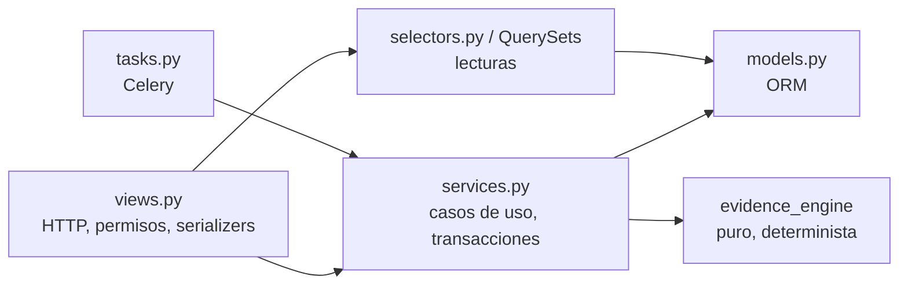

# Backend (Django)

> Estructura, capas y convenciones del proyecto `backend/`. Los modelos están detallados en [04-datos/02-diccionario-de-datos.md](../04-datos/02-diccionario-de-datos.md); los endpoints en [05-api.md](05-api.md); el algoritmo en [06-motor-de-evidencia.md](06-motor-de-evidencia.md).

## 1. Estructura de carpetas

```text
backend/
├── pyproject.toml              # dependencias (uv), config de ruff, mypy, pytest
├── uv.lock
├── manage.py
├── config/                     # proyecto Django
│   ├── settings/
│   │   ├── base.py
│   │   ├── dev.py
│   │   ├── test.py
│   │   └── prod.py
│   ├── urls.py                 # /api/…, /auth/…, /api/schema/
│   ├── celery.py
│   ├── wsgi.py
│   └── asgi.py
├── apps/
│   ├── accounts/               # usuario local (auth0_sub), validación del token de Auth0, onboarding
│   ├── projects/               # proyectos y pertenencia
│   ├── catalog/                # tablas, columnas, interpretaciones, perfiles
│   ├── sources/                # fuentes, ingesta (DDL, muestras), convenciones de nombres
│   ├── evidence/               # modelos Evidence, Conflict; orquestación del motor
│   ├── review/                 # cola, acciones humanas, propagación
│   ├── insights/               # métricas del panorama (cobertura, hallazgos MVP)
│   └── core/                   # utilidades transversales: UUIDModel, permisos, paginación, errores
├── evidence_engine/            # ⚠ Python PURO: no importa Django
│   ├── __init__.py
│   ├── types.py                # dataclasses de entrada/salida (EvidenceItem, ScoreResult…)
│   ├── scoring.py              # puntaje ponderado
│   ├── levels.py               # puntaje → nivel
│   ├── conflicts.py            # detección de contradicciones
│   ├── propagation.py          # destinos de propagación
│   ├── impact.py               # impacto y orden de la cola
│   ├── naming.py               # aplicación de reglas de nomenclatura
│   ├── describe.py             # plantillas deterministas de descripción (modo reglas)
│   └── config.py               # EngineConfig: pesos y umbrales (valores de RN-09, RN-03…)
└── tests/
    ├── conftest.py
    ├── factories/              # factory_boy
    ├── engine/                 # pruebas del motor (sin BD) + hypothesis
    ├── api/                    # pruebas de endpoints (APIClient + PostgreSQL real)
    ├── security/               # acceso cruzado, cabeceras, OAuth malicioso
    └── fixtures/               # DDL y CSV sintéticos (MOV0010…)
```

Cada app sigue la misma forma:

```text
apps/<app>/
├── models.py          # modelos y QuerySets/Managers (consultas reutilizables)
├── services.py        # casos de uso con reglas de negocio y transacciones
├── selectors.py       # consultas de lectura complejas (opcional)
├── serializers.py     # DRF: validación de entrada, forma de salida
├── views.py           # DRF: ViewSets/APIViews delgadas → services/selectors
├── urls.py
├── permissions.py
├── tasks.py           # tareas Celery (delgadas → services)
├── admin.py
└── migrations/
```

## 2. Capas y reglas



| Regla | Detalle |
|---|---|
| B1 | **Las vistas no contienen reglas de negocio.** Validan entrada (serializer), llaman a un service o selector y serializan la salida |
| B2 | **Toda escritura con más de un modelo va en un service** decorado con `@transaction.atomic` |
| B3 | **`evidence_engine` no importa Django ni hace I/O.** Los services convierten modelos a `evidence_engine.types` y persisten el resultado |
| B4 | **Aislamiento por propietario en el QuerySet**, no en la vista: `Project.objects.for_user(user)`, `Column.objects.for_user(user)`. Una vista nunca usa `.objects.all()` sobre datos de cliente (RNF-03) |
| B5 | Los "repositorios" que menciona ROS-176 son **Managers/QuerySets de Django**, no una capa propia (Constitución VI) |
| B6 | Las tareas Celery reciben **IDs**, nunca objetos; son **idempotentes** (reintentar no duplica) |
| B7 | Nada de señales (`post_save`) para reglas de negocio: los efectos se invocan explícitamente desde services |
| B8 | Identificadores de código en inglés; mensajes al usuario en español, centralizados por app en `messages.py` |

## 3. Apps: responsabilidades

| App | Modelos | Services clave | Historias |
|---|---|---|---|
| `core` | `UUIDModel`, `TimeStampedModel` (abstractos) | Manejador de errores DRF, paginación, `IsProjectOwner` | ROS-178 |
| `accounts` | `User` | `Auth0JWTAuthentication` (DRF), `get_or_create_from_token()`, `complete_onboarding()` | ROS-89…93, 180–190 |
| `projects` | `Project` | `create_project()`, `archive_project()`, `get_project_state()` | ROS-78, 81, 172–177 |
| `catalog` | `Table`, `Column`, `ColumnInterpretation`, `ColumnProfile` | `upsert_schema()` (idempotente), selectors de catálogo | ROS-50, 81, 162, 175 |
| `sources` | `Source`, `NamingRule` | `register_schema_upload()`, `register_sample_upload()`, `delete_source()`, adaptadores → evidencia | ROS-16, 17, 21, 22, 23, 120–131 |
| `evidence` | `Evidence`, `Conflict` | `recompute_columns(column_ids)`, `resolve_citation()` | ROS-25–28, 33, 132–142 |
| `review` | `ReviewAction` | `confirm_column()`, `edit_column()`, `reject_column()`, `preview_propagation()`, selectors de cola | ROS-29, 36, 42–48, 140–161 |
| `insights` | — | `coverage()`, `open_findings()` | ROS-37–40, 146 |

## 4. Tareas asíncronas (Celery)

| Tarea | Disparada por | Qué hace | Reintentos |
|---|---|---|---|
| `sources.parse_schema(source_id)` | Subida de DDL | Parsea con sqlglot, `upsert_schema()`, genera evidencia DDL y de nombres, recalcula | 3, backoff exponencial |
| `sources.profile_sample(source_id)` | Subida de CSV | Perfila con polars/pandas, guarda `ColumnProfile`, genera evidencia de perfil y contención, recalcula | 3 |
| `evidence.recompute_project(project_id)` | Cambio de reglas de nomenclatura, eliminación de fuente | Recalcula todas las columnas del proyecto | 1 |

- Umbral para ir a segundo plano: **siempre** para CSV y DDL (simplifica el flujo; la UI siempre sondea). `[NECESITA ACLARACIÓN]` si archivos < 1 MB deben procesarse en línea (RNF-12 solo lo exige > 10 MB).
- Estado visible en `Source.status`: `PENDING → PROCESSING → READY | FAILED` con `error_message` legible (RNF-28).
- En pruebas: `CELERY_TASK_ALWAYS_EAGER = True`.

## 5. Transacciones y concurrencia

La confirmación con propagación (RN-12, RNF-17, RNF-18) es la operación más delicada:

```python
@transaction.atomic
def confirm_column(*, user, column_id, business_name=None, description=None) -> ConfirmResult:
    column = Column.objects.for_user(user).select_for_update().get(pk=column_id)
    targets = propagation_targets(column)                        # evidence_engine
    locked = Column.objects.filter(pk__in=targets).select_for_update()  # orden por pk → sin deadlocks
    action = ReviewAction.objects.create(...)                    # inmutable
    ... marcar CONFIRMED el origen (origin=HUMAN) y los destinos (origin=PROPAGATION, confirmed_by_action=action)
    recompute_columns(affected_ids)                              # vecinos, impacto de la cola
    return ConfirmResult(unlocked_count=len(targets), ...)
```

- Filas bloqueadas **siempre en orden de `pk`** para evitar interbloqueos entre dos confirmaciones simultáneas.
- `preview_propagation()` usa **la misma función** `propagation_targets()` sin escribir: garantiza RN-13 (previsualización = realidad). Hay una prueba que lo verifica.
- Rechazar una confirmación previa revierte los destinos con `confirmed_by_action = esa acción` y `origin = PROPAGATION` (no revierte confirmaciones humanas directas).

## 6. Errores y respuestas

Formato único de error (manejador en `core`):

```json
{
  "error": {
    "code": "column_not_found",
    "message": "La columna no existe o no tienes acceso.",
    "details": {}
  }
}
```

| HTTP | Cuándo |
|---|---|
| 400 | Validación (`details` = errores por campo) |
| 401 | Sin token o token inválido/expirado (el proxy BFF redirige a `/auth/login`) |
| 403 | Autenticado pero la acción no está permitida |
| 404 | Recurso inexistente **o de otro usuario** (no se revela la existencia: RNF-03) |
| 409 | Conflicto de estado (p. ej. confirmar algo ya confirmado; reimportación en curso) |
| 413 | Archivo demasiado grande |
| 422 | Archivo válido pero no procesable (DDL sin `CREATE TABLE`) |

## 7. Configuración

- Toda configuración por variables de entorno (`django-environ`). Lista completa en [08-infraestructura-y-entornos.md](08-infraestructura-y-entornos.md).
- Parámetros del motor (pesos, umbrales) en `evidence_engine/config.py` como **constantes versionadas** (`ENGINE_VERSION`). Cambiarlos = CD sobre [04-reglas-de-negocio.md](../02-requisitos/04-reglas-de-negocio.md) + subir `ENGINE_VERSION` + recalcular. Cada `ColumnInterpretation` guarda la `engine_version` con la que se calculó.

## 8. Convenciones de código

- `ruff` (reglas `E,F,I,B,UP,DJ,S,N`) y `ruff format`; `mypy --strict` en `evidence_engine/`, `mypy` normal en `apps/`.
- Modelos: `id = UUIDField(primary_key=True, default=uuid4)`; `created_at`, `updated_at`; `class Meta: db_table = "<app>_<modelo>"`, `ordering` explícito.
- Enums con `models.TextChoices`; los valores en inglés mayúsculas (`CONFIRMED`, `HIGH_UNVALIDATED`…).
- Nada de SQL crudo salvo justificado en `plan.md` (p. ej. agregados de cobertura).
- Cada función pública de `services.py` y `evidence_engine` tiene docstring con la regla que implementa: `"""Implementa RN-12 (ROS-29)."""`.
