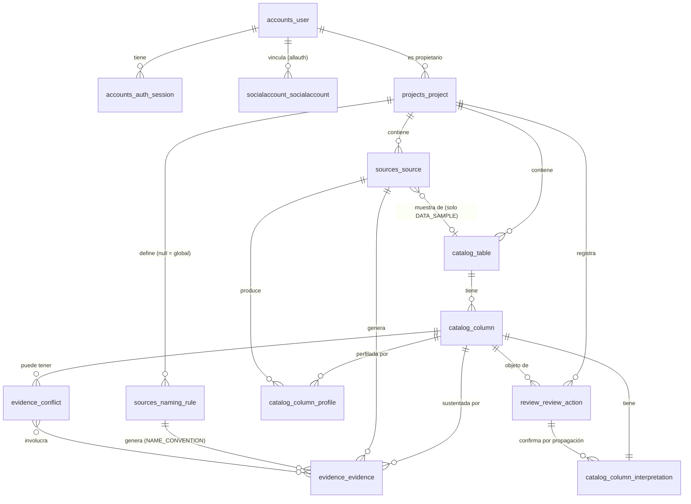
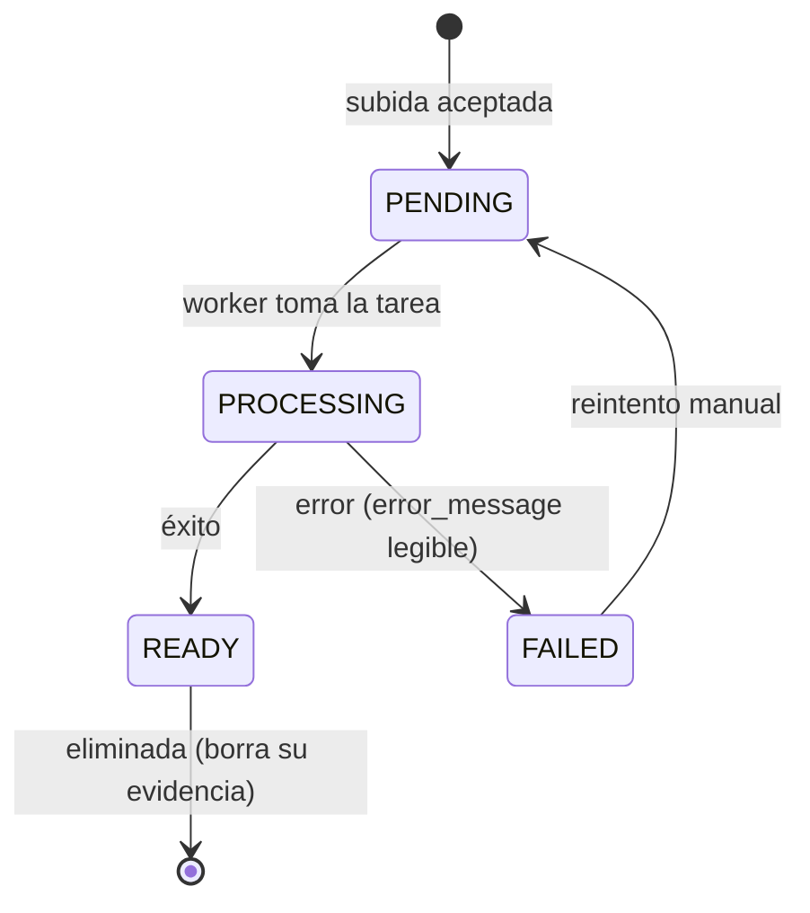

# Modelo de datos

> Modelo **lógico** de la base de datos de Rosetta (PostgreSQL). El detalle columna por columna está en [02-diccionario-de-datos.md](02-diccionario-de-datos.md). La tarea **ROS-175** (Sprint 1) valida este modelo y lo convierte en migraciones; cualquier cambio posterior entra por CD sobre estos dos archivos.
>
> ⚠️ No confundir: las **tablas de Rosetta** (este documento) con las **tablas del cliente** que Rosetta analiza (`MOV0010`, `CTA0001`…), que se guardan como *filas* de `catalog_table` y `catalog_column`.

## 1. Diagrama entidad-relación (MVP)

## 2. Entidades

| Entidad (tabla) | App | Qué representa | Historias |
|---|---|---|---|
| `accounts_user` | accounts | Persona que usa Rosetta (modelo de usuario propio de Django) | ROS-89, 180 |
| `accounts_auth_session` | accounts | Sesión por dispositivo con refresh token hasheado | ROS-92, 180, 187 |
| `socialaccount_socialaccount` | allauth | Vínculo usuario ↔ proveedor OAuth (`provider`, `uid`=sub). Tabla de la librería; equivale a "proveedores_vinculados" de ROS-180 | ROS-90, 180 |
| `projects_project` | projects | Un proyecto = una base de datos del cliente a descifrar | ROS-78, 172 |
| `sources_source` | sources | Archivo cargado (DDL o muestra) y su estado de procesamiento | ROS-16, 17, 22, 175 |
| `sources_naming_rule` | sources | Regla de nomenclatura (`IMPTE`→importe); global o del proyecto | ROS-21, 126 |
| `catalog_table` | catalog | Tabla del esquema del cliente | ROS-16, 50, 175 |
| `catalog_column` | catalog | Columna del esquema del cliente (datos estructurales del DDL) | ROS-16, 50, 175 |
| `catalog_column_interpretation` | catalog | Lo que Rosetta cree que significa la columna: nombre de negocio, descripción, nivel, puntaje, desglose | ROS-25, 26, 136 |
| `catalog_column_profile` | catalog | Perfil estadístico de la columna calculado desde una muestra | ROS-17, 43, 123 |
| `evidence_evidence` | evidence | Una pieza de evidencia normalizada con su cita | ROS-23, 33, 130, 142 |
| `evidence_conflict` | evidence | Contradicción entre evidencias sobre una columna | ROS-28, 138 |
| `review_review_action` | review | Acción humana inmutable (confirmar, editar, rechazar) | ROS-46, 83, 158 |

**Decisiones de modelado:**
- Separar `catalog_column` (hechos del DDL, cambian solo al reimportar) de `catalog_column_interpretation` (conclusiones del motor y del humano, cambian en cada recálculo). Permite recalcular sin tocar la estructura y, en Fase 2, versionar interpretaciones (ROS-82).
- La **cola** no es una tabla: es una consulta ordenada sobre `catalog_column_interpretation` (`impact`, `level`), con índice.
- La **propagación** se registra con `catalog_column_interpretation.confirmed_by_action_id` + `origin = PROPAGATION`: permite revertir todo lo que salió de una acción.
- Los **hallazgos del MVP** no son tabla: se derivan de conflictos abiertos y columnas `UNKNOWN` (RN-16).
- Relaciones inferidas entre columnas (ROS-30, Fase 2) no tienen tabla en el MVP; la referencia elegida se guarda en `catalog_column_interpretation.references_column_id`.

## 3. Estados y ciclos de vida

### `sources_source.status`

### `catalog_column_interpretation.level`

```mermaid
stateDiagram-v2
    [*] --> UNKNOWN: importada sin evidencia útil
    UNKNOWN --> HYPOTHESIS: llega evidencia
    HYPOTHESIS --> INFERRED: ≥2 fuentes coinciden y puntaje ≥ umbral
    INFERRED --> HIGH_UNVALIDATED: puntaje ≥ 0,85 sin conflicto
    HIGH_UNVALIDATED --> INFERRED: aparece conflicto o baja el puntaje
    INFERRED --> HYPOTHESIS: pierde evidencia
    HYPOTHESIS --> UNKNOWN: pierde evidencia
    UNKNOWN --> CONFIRMED: Confirmar (humano)
    HYPOTHESIS --> CONFIRMED: Confirmar (humano)
    INFERRED --> CONFIRMED: Confirmar (humano)
    HIGH_UNVALIDATED --> CONFIRMED: Confirmar (humano) o propagación
    CONFIRMED --> HYPOTHESIS: Rechazar (recalcula; normalmente baja)
```

> Solo las transiciones hacia `CONFIRMED` las ejecuta `review`; todas las demás las produce el motor. Desde `CONFIRMED` solo se sale por **Rechazar** (o por reversión de la acción de origen si fue propagada).
> `[NECESITA ACLARACIÓN]` ¿Se permite confirmar directamente una columna `UNKNOWN` o `HYPOTHESIS`? Propuesta: **sí**, siempre que el revisor escriba el nombre de negocio (confirmar con edición). Ver [DP-003](../07-registro/02-decisiones-pendientes.md).

## 4. Índices y restricciones relevantes

| Tabla | Índice / restricción | Motivo |
|---|---|---|
| `projects_project` | `(owner_id, created_at desc)`; único `(owner_id, lower(name))` donde `archived_at is null` | Listado; evitar nombres duplicados activos |
| `projects_project` | `(organization_id)` | Preparación multi-tenant (ADR-0004) |
| `sources_source` | `(project_id, created_at desc)`; único `(project_id, kind, sha256)` | Listado; idempotencia de reimportación (RNF-19) |
| `catalog_table` | único `(project_id, schema_name, name)` | *Upsert* por nombre |
| `catalog_column` | único `(table_id, name)`; `(project_id, name_normalized, data_type_normalized)` | *Upsert*; búsqueda de destinos de propagación |
| `catalog_column_interpretation` | `(project_id, level)`; `(project_id, impact desc)` parcial `where level <> 'CONFIRMED'` | Cobertura; cola |
| `evidence_evidence` | `(column_id)`; `(source_id)`; `(naming_rule_id)` | Ficha; borrado de fuente; recálculo por regla |
| `evidence_conflict` | `(project_id, status)` | Conflictos abiertos |
| `review_review_action` | `(column_id, created_at)`; `(project_id, created_at)` | Historial y auditoría |
| `accounts_auth_session` | único `(refresh_token_hash)`; `(user_id, revoked_at)`; `(family_id)` | Refresh; sesiones activas; revocación por familia |

Todas las FK con `ON DELETE` explícito: `CASCADE` desde `project` hacia todo su contenido; `PROTECT` desde `review_review_action` hacia `accounts_user` (no se borra un usuario con acciones auditadas; se desactiva).

## 5. Volumen de referencia

Caso del prototipo: **918 tablas, 18.442 columnas** (RNF-14). Estimación por proyecto de ese tamaño:

| Tabla | Filas estimadas |
|---|---|
| `catalog_table` | ~1.000 |
| `catalog_column` / `catalog_column_interpretation` | ~20.000 |
| `evidence_evidence` | ~100.000 (≈5 por columna) |
| `catalog_column_profile` | ≤ 20.000 por muestra |
| `review_review_action` | miles |

Cabe cómodamente en PostgreSQL; los cuidados son de índices y de no cargar todo en memoria en el motor (recalcular por lotes).
